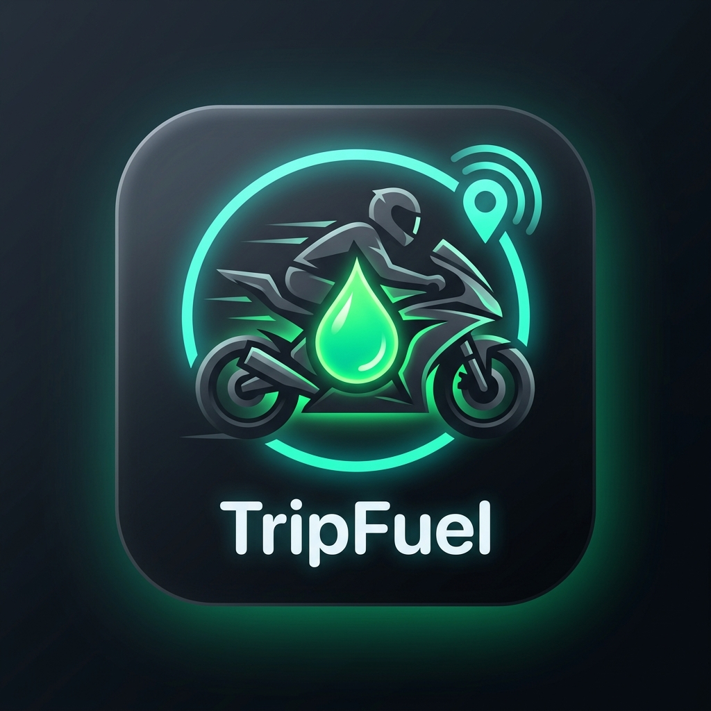

# 🛵 TripFuel v1.2 – Flagship GPS Fuel Tracking, Weekly Analytics & OpenStreetMap Nearby Radar

<p align="center">
  
</p>

**TripFuel** is a flagship Android application designed specifically for **Rapido, Porter, Uber Moto, Swiggy, Zomato, and delivery riders**. Built with **Android Jetpack Compose**, **Material 3 Expressive**, **Liquid Glass Aesthetics**, **OpenStreetMap (OSM) Nearby Radar**, and 100% **Offline Local Phone Storage**.

---

## 📲 Direct APK Download (v1.2)

📥 **[Click Here to Download TripFuel-v1.2.apk](https://github.com/dipu-dev-labs/TripFuel/releases/download/v1.2/TripFuel-v1.2.apk)**

---

## 📸 App Screenshots & Real Demo

| **Analytics & Settings** | **Live GPS Tracking** |
|:---:|:---:|
|  |  |
| **Ride Summary & Profits** | **Home Dashboard** |
|  |  |

---

## ✨ Key Features in v1.2

- 🗺️ **OpenStreetMap (OSM) Nearby Rider Radar:** Interactive OpenStreetMap dark vector radar view displaying nearby delivery riders (Zomato, Swiggy, Rapido, Uber Moto, Porter) in 1 km radius.
- 🔔 **Proximity Sound & Crossing Notification Alerts:** Instant status bar notification & vibration alert when a fellow rider crosses or comes within 100 meters:
  > 🛵 *Nearby Rider Alert! Zomato Rider (Rahul S.) is 80m away!*
- ⚡ **Stateless Ephemeral Relay (Zero Database Storage):** Location pings are handled purely in RAM memory over mobile data and auto-expire in 30 seconds. Zero disk storage & zero database costs.
- 📊 **Weekly Stats & Profit vs. Petrol Dual Graph:** Home Dashboard card featuring 7-day Net Profit bars (Green) vs. Petrol Usage curve (Yellow).
- 🎨 **Liquid Glass Design Language:** Deep dark background (`#0B0F14`), Neon Electric Green (`#00E676`) & Teal Cyan (`#64FFDA`) visual tokens, frosted glass cards, gradient borders, and 60fps micro-animations.
- 📍 **High-Precision GPS Ride Tracking:** Tracks exact distance, ride duration, and live speed with continuous fuel cost calculations.
- 📲 **24/7 Background Service & Lock Screen Tracking:** Persistent status bar notification keeps tracking active even when switching apps or with screen turned OFF.
- 💰 **Instant Net Profit Calculator:** Quick-Add presets for Rapido, Porter, Uber Moto, Swiggy, Zomato, and Custom earnings auto-calculate Net Profit.
- 🔒 **100% Offline Local DB:** Uses local phone storage (`SharedPreferences` + `Gson` JSON) for zero cloud latency and total data privacy.

---

## 🛠️ Technology Stack

* **Language:** Kotlin 2.2+
* **UI Framework:** Android Jetpack Compose + Material 3 Expressive
* **Map Engine:** OpenStreetMap (OSM) Canvas Radar Engine
* **Architecture:** StateFlow, Coroutines, Ephemeral Spatial Radar Engine
* **Background Service:** Android Foreground Service with Sticky Notification
* **Local Storage:** Phone Local Storage (JSON / SharedPreferences)
* **Build System:** Gradle 9.5 (Android Gradle Plugin 9.3)

---

## 🚀 How to Run Locally

1. Clone or open the repository in **Android Studio**:
   ```bash
   git clone https://github.com/dipu-dev-labs/TripFuel.git
   ```
2. Build the project using Gradle:
   ```bash
   ./gradlew assembleDebug
   ```
3. Run on an Android Device or Emulator (Android 7.0 / API 24+).

---

## 🔗 Official Repository Link

📌 **GitHub Repository:** [https://github.com/dipu-dev-labs/TripFuel](https://github.com/dipu-dev-labs/TripFuel)

---

## 📝 License

Distributed under the MIT License. See `LICENSE` for more information.
